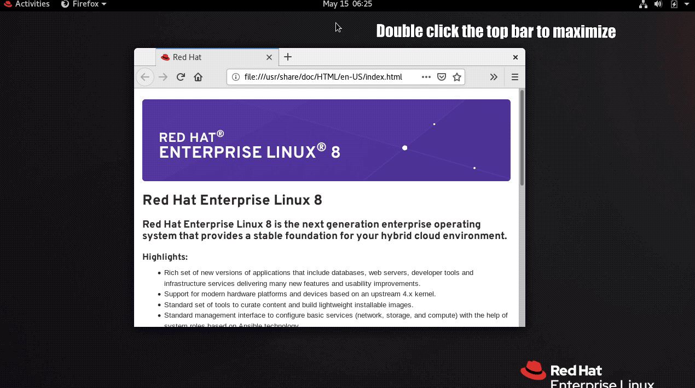
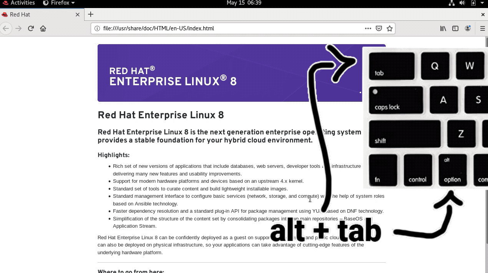

# Red Hat PE180 Exam Tips

 

    

 

> ***Disclaimer:*** This is a personal github repository and **IS NOT** affiliated with Red Hat in any way. All the information provided here are from my personal experience. The red hat logo is a registered trademark of Red Hat,
Inc. in the United States and other countries. 

> ***Note:*** This repository was written on the 15th of May 2020. The contents/format of the exam might have changed by the time you are reading this now. Use these tips at your own risk.

This repository will provide you with tips and tricks to help you pass the PE180 Red Hat Preliminary Exam in Containers, Kubernetes, and Openshift. 

This repository will cover the common problems that face people during the PE180 exam like environment specific problems, limited time and how to boost your workflow in order to solve faster. It will also cover the general tips and tricks and useful information like the commands needed in the exam and some important flags that wasn't mentioned in the DO180 course.

## Table of contents

1. [Overview](#Red-Hat-PE180-Exam-Tips)
2. [Environment Issues](#Environment-Issues)
3. [Exam & Solving Strategy](#Exam-&-Solving-Strategy)
4. [Commands Needed](#Commands-Needed)
5. [Hidden Tricks](#Hidden-Tricks)
6. [Conclusion](#Conclusion)

## Environment Issues

Depending on your geo location and internet connection stability/speed, you may find the exam's virtual remote environment to be laggy and unstable. I personally experienced multiple disconnects and very slow UI response which hindered my performance in the exam. Below are some tips that might help you and boost your workflow.

1. Maximize all the windows and switch between them using alt + tab

    Switching between the terminal and the exam instructions with your mouse wastes a lot of time since the mouse is very buggy and laggy and will have some delay to follow the trail of your real mouse. I suggest you maximize all your screens and switch between them using alt + tab.

    Note that RHEL has no maximize button, so in order to maximize, you can double click the top bar of any windows and it will maximize. Check the gifs below for reference.

    

    

## Exam & Solving Strategy

## Commands Needed

## Hidden Tricks

## Conclusion

