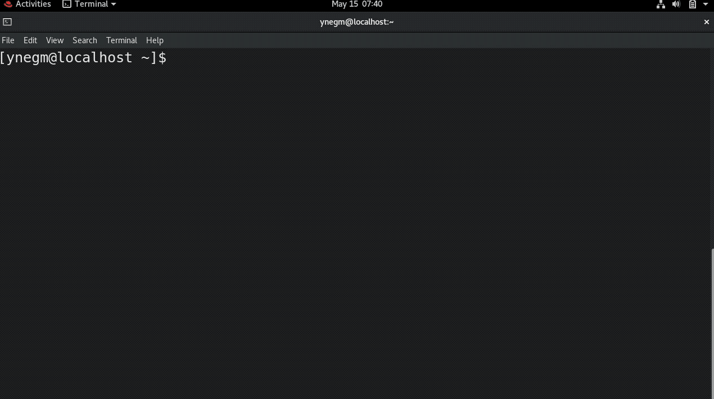

# Red Hat PE180 Exam Tips

 

    

 

> ***Disclaimer:*** This is a personal github repository and **IS NOT** affiliated with Red Hat in any way. All the information provided here are from my personal experience. The red hat logo is a registered trademark of Red Hat,
Inc. in the United States and other countries. 

> ***Note:*** This repository was written on the 15th of May 2020. The contents/format of the exam might have changed by the time you are reading this now. Use these tips at your own risk.

This repository will provide you with tips and tricks to help you pass the PE180 Red Hat Preliminary Exam in Containers, Kubernetes, and Openshift. 

This repository will cover the common problems that face people during the PE180 exam like environment specific problems, limited time and how to boost your workflow in order to solve faster. It will also cover the general tips and tricks and useful information like the commands needed in the exam and some important flags that wasn't mentioned in the DO180 course.

## Table of contents

1. [Overview](#Red-Hat-PE180-Exam-Tips)
2. [Environment Issues](#Environment-Issues)
3. [Exam & Solving Strategy](#Exam-&-Solving-Strategy)
4. [Commands Needed](#Commands-Needed)
5. [Hidden Tricks](#Hidden-Tricks)
6. [Conclusion](#Conclusion)

## Environment Issues

Depending on your geo location and internet connection stability/speed, you may find the exam's virtual remote environment to be laggy and unstable. I personally experienced multiple disconnects and very slow UI response which hindered my performance in the exam. Below are some tips that might help you and boost your workflow.

1. **Maximize all the windows and switch between them using alt + tab**

    Switching between the terminal and the exam instructions with your mouse wastes a lot of time since the mouse is very buggy and laggy and will have some delay to follow the trail of your real mouse. I suggest you maximize all your screens and switch between them using alt + tab.

    Note that RHEL has no maximize button, so in order to maximize, you can double click the top bar of any windows and it will maximize. Check the gifs below for reference.

    

    

 

2. **Use gedit for editing text files (dockerfiles and shell scripts)**

    Throughout the exam, you will be asked to edit dockerfiles and shell scripts. Use gedit to create/modify these files. gedit is a GUI-based text editor that will make your workflow much easier compared to vim or nano. To use it, type the following in ur terminal:

        gedit <filename>
    
    This will open the file specified in the command argument. gedit will allow you to use the normal saving/copying/pasting shortcuts we all know. Check the gif below for reference.

    *Hint: You can use CTRL + S to save then CTRL + Q to close the gedit. This will save you some time.*

    

 

3. **Use [CTRL + Shift + C] and [CTRL + Shift + V] to copy and paste inside the terminal**

    You should use copy and paste as much as you can in this exam. It's full of long container image names, environment variables and long dockerfile commands. The normal **CTRL + C** and **CTRL + V** works in the browser and in gedit. But in the terminal, they don't work so make sure you use **CTRL + SHIFT + C** and **CTRL + SHIFT + V**. This way you won't have to spend much time writing long commands and instructions manually. It will also save you from typos!

## Exam & Solving Strategy

In this section, I'll share how I tackled the questions and talk briefly about each question and share some general tips. Note that some of the questions below contain hidden tricks that I will be discussing in the next section. 

1. **Start with Q1, Q2 & Q5 (in the same order) then attempt Q3 & Q4**

    Questions 1, 2 and 5 are all regarding the same container image and they depend on each other so it's better if you finish them all at first then attempt Q3 and Q4. This will ensure that even if you didn't have enough time to finish Q3 & Q4, you would at least have finished more than 50% of the exam which will increase ur chance in succeeding.

2. **Read the instructions from the web browser not from the shell script**

    In some questions, you will be instructed to navigate to a certain directory and modify a shell script. Some of these shell scripts contain instructions as well. It is advised to take your instructions only from the web browser because I have noticed that some of the instructions written inside the shell scripts were missing, vague and confusing. So please stick to the web browser for instructions.

3. **Question one**

    In this question, you will be asked to navigate to a directory that has a dockerfile. Your job will be to successfully build that dockerfile into a docker image. **BEWARE** that questions 2 and 5 depend on the correctness of this question, so if you mess up this question, your chances of passing the exam will be very low.

    The dockerfile you're supposed to edit already has lots of commands written for you. The real challenge is where to put your new commands inside this dockerfile. One thing that I have found useful were the comments written inside the dockerfile, they should roughly give you an idea about where each command should go.

    After editing the dockerfile, you should attempt to build it. If the build was successful, don't test the image and make a container out of it because you will be asked to do that in question 2. It will be redundant and a waste of time if you test your image twice.

4. **Question two**

    In this question, you will be testing what you did in question 1. You will be asked to navigate somewhere and modify 3 existing shell scripts (.sh).

    > ***Hint:*** the commands below will be written inside the .sh file not in the terminal directly

    In the first .sh file, you are asked to write a command that would start a container with specific flags and configurations. This should be easy as it looks like most of the stuff in the DO180 labs. After editing save the .sh file, save and exit.

    In the second .sh file, you are asked to write a command that would print out the last 10 lines of the logs of a certain container. I will cover how to do that in the next section. After editing save the .sh file, save and exit.

    In the third .sh file, you are asked to write two commands that would run after each other. One command to stop a running container and another command to remove that container.

    After finishing all the .sh files, run them in the following order:
    1. The start script
    2. The logs script
    3. The stop/remove script

    *To run a .sh script, use the format below in your terminal:*

        ./<file name>.sh

5. **Question five**

    In this question, the first part asks you to tag the image you built in question 1 with a certain tag and push it to a local registry that is given to you. This should be easy because we did it multiple times in the labs of DO180.

    The second part asks you to save the newly tagged image as a .tar file to a **specific location**. You can do so by using the following command:

        sudo podman save -o <output_file_name>.tar <name of the image to be save>

6. **Questions three & four**

    These two questions are almost identical. They both will ask you to modify two separate .sh files (shell scripts). In both questions, the .sh files should create a new containers with specific flags, configurations and images that are given to us.

    Q3 asks us to run a database container, and Q4 asks us to run a wordpress container that connects to the database of Q3.

    Note that you will find two Dockerfiles. One in Q3's directory and another in Q4's directory, **DO NOT ATTEMPT** to build them! They are just there to mislead you. Act as if the dockerfiles aren't there, just open the shell scripts edit them according to the instructions in the web browser and write the name of the image as given and the image will be pulled from an external registry, you don't need to build the dockerfile to get the image.

    Also note in the `sudo podman run` command of **BOTH** questions, include the flag --pod as instructed in Q3. If you don't do so, the wordpress container will not run as it will not be able to connect to the database.

    Finally, when you're running the two shell scripts, make sure you run the shell script of Q3 first then the shell script of Q4.

## Commands Needed

## Hidden Tricks

docker copy add from absolute path

the unzip

logs

pods

## Conclusion

